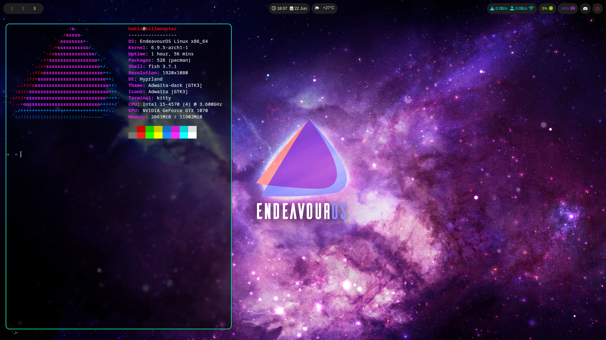

# Ekran Görüntüsü


# Önemli
Bu işlemler Arch tabanlı distro'lar için genel olarak uygundur.

Her şeyden önce eğer burdaki bir aracı veya hepsini kurmak istiyorsanız bu repo'yu `~/.config` dizini içerisine clone'leyin ki burda gördünüz ayarları elde edebilin.

# Liste
Configlerde kullanılan araçlar burdadır. Hepsinin olabildiğince açıklaması yapılmıştır.
Bundan yola çıkarak sizin istemediğiniz bir şey varsa farklı bir alternatifini kullanabilir ya da hiç kullanmayabilirsiniz. 

- [Ekran Görüntüsü](#ekran-görüntüsü)
- [Önemli](#önemli)
- [Liste](#liste)
  - [Her şey](#her-şey)
  - [Sddm](#sddm)
  - [Hyprland](#hyprland)
  - [Hyprpaper](#hyprpaper)
  - [Waybar](#waybar)
  - [Kitty](#kitty)
  - [Rofi](#rofi)
  - [Fish](#fish)

## Her şey
Eğer burdaki her şeyi istiyorum diyorsanız bu komutları sırasıyla çalıştırarak kurulumu tamamliyabilirsiniz.

```console
$ sudo pacman -S sddm hyprland discord wl-clipboard dunst dolphin hyprpaper waybar otf-font-awesome curl kitty rofi fish neofetch
$ yay -S brave-bin
$ sudo eos-download-wallpapers
$ chsh -s /usr/bin/fish
$ sudo systemctl enable --now sddm
```

## Sddm
[Sddm](#sddm) bizim kullanıcı oturumu açmak ve pencere yöneticisini başlatmak için kullandığımız araç.

Kurmak için ilk başta indiriyoruz ve daha sonrasında `systemctl` ile birlikte başlatıyoruz.

```console
$ sudo pacman -S sddm
$ sudo systemctl enable --now sddm
```


## Hyprland
Kullandığımız pencere yöneticisi [Hyprland](#hyprland).

Kurulumda tarayıcı olarak `brave` seçilmiştir ve kurmak için `yay` kurulu olmalıdır. Tarayıcı istenirse config dosyası üzerinden değiştirilebilir.

Aynı zamanda `discord` her sistem açıldığında otomatik olarak başlatılmaya ayarlanmıştır. Kullanmıyor olabilirsiniz bu yüzden kaldırabilirsiniz.

`wl-clipboard` ise screenshot almak gibi işler için işimizi görüyor.

`dunst` screenshot gibi şeyler yapıldığında bize bildirim kutusunda haber veren araçtır.

`dolphin`'de otomatik olarak ayarlanan dosya yöneticisidir.

```console
$ sudo pacman -S hyprland discord wl-clipboard dunst dolphin
$ yay -S brave-bin
```

## Hyprpaper
[Hyprland](#hyprland) üzerinde kendi özel wallpaper'larınızı kullanmak istiyorsanız aşağıdaki gibi [Hyprpaper](#hyprpaper)'ı kurabilirsiniz.

```console
$ sudo pacman -S hyprpaper
```

Aynı zamanda EndeavourOS kullanıyorsanız topluluk tarafından paylaşılan wallpaperları aşağıdaki komut ile indirebilirsiniz.

Kullandığımız bu config'de otomatik olarak bu topluluk wallpaperlardan biri ayarlanmıştır. İnceliyerek değiştirebilirsiniz.

```console
$ sudo eos-download-wallpapers
```

## Waybar
Eğer ekranınızın üzerinde bir bar istiyorsanız [Waybar](#waybar) aracını aşağıdaki gibi indirmelisiniz.

Temiz bir kurulum yaptıysanız iconları görmek için `otf-font-awesome`'ı indirmeniz gereklidir. `curl` ise [Waybar](#waybar) üzerindeki hava durumu bilgisini çekmek için kullanılmaktadır.

```console
$ sudo pacman -S waybar otf-font-awesome curl
```

## Kitty
[Hyprland](#hyprland)'de kullanabileceğiniz bir çok terminal bulunuyor ama bugünkü tercihimiz [Kitty](#kitty) olucaktır. Aşağıdaki gibi indirebiliriz.

```console
$ sudo pacman -S kitty
```

## Rofi
[Hyprland](#hyprland)'de Windows ve MacOS da olduğu gibi bir start menüsü ve masaüstü yok. Uygulamaları çalıştırmak için bunun gibi uygulama başlatıcıları kullanıyoruz.

Burdaki tercihimiz [Rofi](#rofi)'dir. Kurmak için aşağıdaki komutu çalıştırmanız yeterlidir.

```console
$ sudo pacman -S rofi
```

## Fish
Sistemimizde shell olarak [Fish](#fish)'i tercih ediyoruz. Terminal açıldığında hem güzel gözükmesi için hemde sistemimiz ile ilgili bilgileri edinmek için `neofetch` indiriyoruz.

Kurmak için ilk önce indiriyoruz ve daha sonrasında her terminal başlatıldığında [Fish](#fish) ile başlayabilmek için `chsh` komutu ile shell'imizi ayarlıyoruz.

```console
$ sudo pacman -S fish neofetch
$ chsh -s /usr/bin/fish
```
